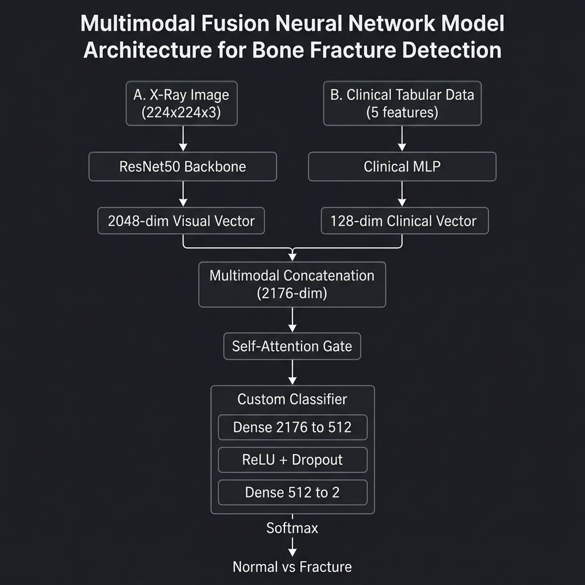

# 🧠 Multimodal Bone Fracture Detection Architecture

---

# 🖼️ Architecture Diagram



> 📌 *Note:* Place your image in `assets/model_architecture.png` or update the path accordingly.

---

# 📌 1. High-Level Overview

The BoneFractureAI system is a **Multimodal Fusion Network** that combines a **Convolutional Neural Network (ResNet50)** for X-ray images with a **Multi-Layer Perceptron (MLP)** for patient clinical data (Age, BMI, Medical History).

### 🎯 Objective

* Detect bone fractures by analyzing **both** visual X-ray data and clinical risk factors.
* Provide risk classification: **Normal vs Fractured**
* Generate **dual-explainability** using **Grad-CAM** (Visual) and **SHAP** (Clinical).

---

## 🔑 Key Highlights

| Component             | Description                    |
| --------------------- | ------------------------------ |
| **Architecture Type** | Multimodal Attention Fusion    |
| **Base Models**       | ResNet50 (Visual) + MLP (Text) |
| **Task**              | Binary Risk Classification     |
| **Inputs**            | 224×224×3 (Image) + 5 Features |
| **Output**            | 2 Classes (Normal, Fracture)   |
| **Explainability**    | Grad-CAM (Image) + SHAP (Text) |

---

# 🏗️ 2. Complete Model Pipeline

```text
Input Image  → Preprocessing → ResNet50 (2048) \
                                                → Attention Fusion → Classifier → Output
Clinical Data → Normalization → MLP (64)       /
```

---

# 🔍 3. Detailed Architecture

---

## 🧾 3.1 Stage 1: Input & Preprocessing

### Input

* X-ray Image (RGB or Grayscale)

### Processing Steps

1. Resize → **224 × 224**
2. Normalize using ImageNet statistics

### 📐 Formula

```math
x_normalized = (x - mean) / std
```

Where:

* mean = [0.485, 0.456, 0.406]
* std = [0.229, 0.224, 0.225]

---

## 🧠 3.2 Stage 2: ResNet50 Backbone (Feature Extractor)

### 🔹 Key Idea

ResNet50 extracts **high-level features** like:

* edges
* textures
* bone structures

---

### 📊 Architecture Summary

| Layer   | Output Shape | Parameters |
| ------- | ------------ | ---------- |
| Conv1   | 112×112×64   | 9,408      |
| MaxPool | 56×56×64     | -          |
| Layer1  | 56×56×256    | 215K       |
| Layer2  | 28×28×512    | 1.2M       |
| Layer3  | 14×14×1024   | 7.1M       |
| Layer4  | 7×7×2048     | 15M        |
| AvgPool | 1×1×2048     | -          |

👉 Total Parameters: **23.5M**

---

### 🔁 Residual Learning (Core Concept)

```math
Output = ReLU(F(x) + x)
```

✅ Solves **vanishing gradient problem**
✅ Enables **deep networks**

---

## 🎯 3.3 Stage 3: Clinical MLP & Attention Fusion

### Inputs

* Visual Feature Vector (from ResNet50): **2048**
* Clinical Feature Vector (Age, BMI, Sex, Diabetes, Falls): **5**

---

### Layer Breakdown

#### 🔹 Clinical Multi-Layer Perceptron (MLP)
Maps raw clinical data into a higher-dimensional feature space.
* 5 → 32 → 64
* Includes BatchNorm and ReLU activations.

#### 🔹 Feature Concatenation
* Visual (2048) + Clinical (64) = **Combined Vector (2112)**

#### 🔹 Attention Mechanism
Learns which features (visual vs clinical) are most critical for the specific patient.
```math
attn_weights = Sigmoid(W_attn · Combined)
attended_features = Combined ⊙ attn_weights
```

#### 🔹 Final Classification Head
* 2112 → 512 → 256 → 2

---

### 🔹 Output (Softmax)

```math
P(class) = exp(z) / Σ exp(z)
```

---

### 📊 Additional Parameters

| Layer             | Parameters |
| ----------------- | ---------- |
| Clinical MLP      | ~2,300     |
| Attention Network | ~4.4M      |
| Classification    | ~1.2M      |
| **Total Head**    | ~5.6M      |

---

### 🔢 Total Model Parameters

👉 **~29.1 Million Parameters**

---

# 📐 4. Mathematical Formulation

---

## 🔁 Forward Pass

```math
F_visual = ResNet50(Image_norm)
F_clinical = MLP(Clinical_norm)
F_combined = Concat(F_visual, F_clinical)
F_attended = F_combined ⊙ Sigmoid(W_attn · F_combined)
z = Classifier(F_attended)
ŷ = Softmax(z)
```

---

## 📉 Loss Function (Cross Entropy)

```math
L = -[y log(ŷ1) + (1-y) log(ŷ0)]
```

---

## ⚙️ Optimization (Adam)

```math
θ = θ - α * m̂ / (√v̂ + ε)
```

### Hyperparameters

* Learning Rate: **1e-4**
* β1 = 0.9
* β2 = 0.999

---

# 🎨 5. Explainable AI (Grad-CAM & SHAP)

---

## 🎯 5.1 Visual Explainability (Grad-CAM)

To **visualize important regions** in X-ray images.

```math
α = avg(∂y / ∂A)
L = ReLU(Σ αk · Ak)
```

| Color     | Meaning         |
| --------- | --------------- |
| 🔴 Red    | High importance |
| 🟡 Yellow | Medium          |
| 🔵 Blue   | Low             |

---

## 📊 5.2 Clinical Explainability (SHAP)

To quantify the mathematical impact of **patient medical history** on the final risk prediction.

* **SHAP Values (Shapley Additive exPlanations)** break down the MLP's contribution.
* **Positive values (Red Bars)**: Factors (e.g., history of falls) that actively increased the fracture probability.
* **Negative values (Blue Bars)**: Protective factors that decreased fracture probability.

---

# 🏋️ 6. Training Strategy

---

## 🔹 Phase 1: Feature Extraction

* Freeze ResNet50
* Train classifier only

## 🔹 Phase 2: Fine-Tuning

* Unfreeze last layers
* Lower learning rate

---

## 🔹 Data Augmentation

* Flip
* Rotation
* Brightness changes

---

## 🔹 Hyperparameters

| Parameter  | Value  |
| ---------- | ------ |
| Batch Size | 16     |
| Epochs     | 10–30  |
| Optimizer  | Adam   |
| LR         | 0.0001 |
| Dropout    | 0.5    |

---

# 📊 7. Evaluation Metrics

| Metric    | Formula       | Meaning                      |
| --------- | ------------- | ---------------------------- |
| Accuracy  | (TP+TN)/Total | Overall correctness          |
| Precision | TP/(TP+FP)    | Correct fracture predictions |
| Recall    | TP/(TP+FN)    | Detection ability            |
| F1 Score  | Harmonic mean | Balance                      |

---

# 🤔 8. Why This Architecture?

* ✅ ResNet50 → Strong pretrained features
* ✅ Transfer Learning → Less data required
* ✅ Dropout → Prevent overfitting
* ✅ Grad-CAM → Medical explainability

---

# 💻 9. Code Implementation

```python
class MultimodalFractureModel(nn.Module):
    def __init__(self):
        super().__init__()
        # Visual
        self.backbone = models.resnet50(pretrained=True)
        self.backbone.fc = nn.Identity()
        
        # Clinical
        self.clinical_mlp = nn.Sequential(
            nn.Linear(5, 32), nn.ReLU(),
            nn.Linear(32, 64), nn.ReLU()
        )
        
        # Fusion
        self.attention = nn.Sequential(
            nn.Linear(2112, 2112), nn.Sigmoid()
        )
        self.classifier = nn.Sequential(
            nn.Linear(2112, 512), nn.ReLU(),
            nn.Linear(512, 2)
        )

    def forward(self, img, clinical):
        img_features = self.backbone(img)
        clin_features = self.clinical_mlp(clinical)
        
        combined = torch.cat((img_features, clin_features), dim=1)
        attended = combined * self.attention(combined)
        return self.classifier(attended)
```

---

# 🎓 10. Final Summary

* Model: **Multimodal Fusion (ResNet50 + MLP)**
* Parameters: **~29.1M**
* Task: **Multimodal Risk Prediction**
* Key Feature: **Dual-Explainability (Grad-CAM & SHAP)**

---

# 🚀 Conclusion

This architecture provides:

* **Robustness**: Combines visual imaging with hard clinical data.
* **Deep Interpretability**: Clinicians can see *where* the AI looked (Grad-CAM) and *why* the patient history matters (SHAP).
* **High Clinical Utility**: Mirrors real-world radiological workflows.

👉 Ideal for **next-generation Clinical Decision Support Systems (CDSS)**

---
